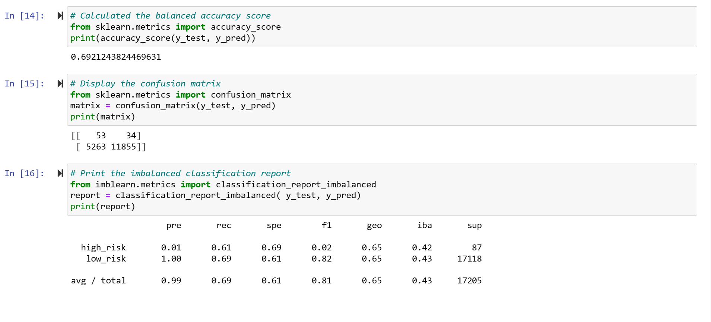
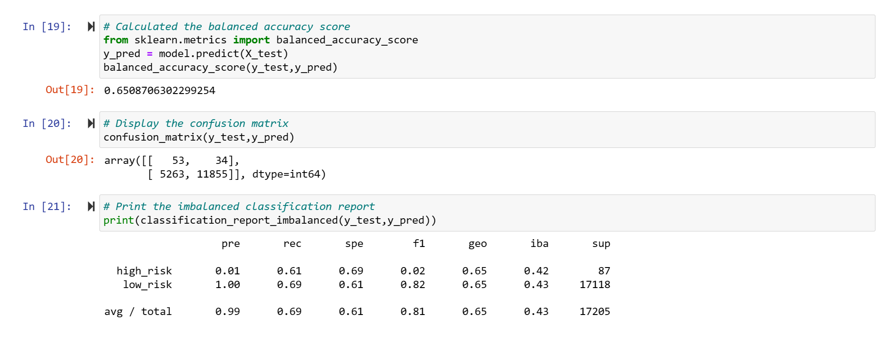

# credit_analysis
# Overview of the loan prediction risk analysis: 
### Explain the purpose of this analysis.

Using the credit card credit dataset from LendingClub, a peer-to-peer lending services company, we’ll oversample the data using the **RandomOverSampler and SMOTE algorithms**, and **undersample the data using the ClusterCentroids algorithm**. Then, we’ll use a combinatorial approach of over and undersampling using the **SMOTEENN algorithm**. Next, we’ll compare two new machine learning models that reduce bias, **BalancedRandomForestClassifier and EasyEnsembleClassifier**, to predict credit risk. Once we done, we’ll evaluate the performance of these models and make a written recommendation on whether they should be used to predict credit risk.

# Results: 
### Using bulleted lists, describe the balanced accuracy scores and the precision and recall scores of all six machine learning models. Use screenshots of your outputs to support your results.

**Deliverable 1: Use Resampling Models to Predict Credit Risk**
Using your knowledge of the **imbalanced-learn and scikit-learn libraries**, you’ll evaluate three machine learning models by using resampling to determine which is better at predicting credit risk. First, you’ll use the **oversampling RandomOverSampler and SMOTE algorithms**, and then you’ll use the **undersampling ClusterCentroids algorithm**. Using these algorithms, you’ll resample the dataset, view the count of the target classes, train a logistic regression classifier, calculate the balanced accuracy score, generate a confusion matrix, and generate a classification report.

* Using the information we’ve provided in the starter code, create your training and target variables by completing the following steps:
    * Create the training variables by converting the string values into numerical ones using the get_dummies() method.
    * Create the target variables.
    * Check the balance of the target variables.
    * Next, begin resampling the training data. First, use the oversampling RandomOverSampler and SMOTE algorithms to resample the data, then use the undersampling           ClusterCentroids algorithm to resample the data. For each resampling algorithm, do the following:

* Use the LogisticRegression classifier to make predictions and evaluate the model’s performance.
    * Calculate the accuracy score of the model.
    * Generate a confusion matrix.
    * Print out the imbalanced classification report.
    
    * **Random Oversampling:**
   

    
    * **SMOTE oversampling**:
    
 
 
     * **Under Sampling**:
  

**Deliverable 2: Use the SMOTEENN algorithm to Predict Credit Risk**
Using your knowledge of the **imbalanced-learn and scikit-learn libraries**, you’ll use a combinatorial approach of **over- and undersampling with the SMOTEENN algorithm** to determine if the results from the combinatorial approach are better at predicting credit risk than the **resampling algorithms** from Deliverable 1. Using the **SMOTEENN algorithm**, you’ll resample the dataset, view the count of the target classes, train a logistic regression classifier, calculate the balanced accuracy score, generate a confusion matrix, and generate a classification report.

Follow the instructions below and use the information in the credit_risk_resampling_starter_code.ipynb file to complete Deliverable 2.

* Continue using your credit_risk_resampling.ipynb file where you have already created your training and target variables.
* Using the information we have provided in the starter code, resample the training data using the SMOTEENN algorithm.
* After the data is resampled, use the LogisticRegression classifier to make predictions and evaluate the model’s performance.
* Calculate the accuracy score of the model, generate a confusion matrix, and then print out the imbalanced classification report.

**Deliverable 3: Use Ensemble Classifiers to Predict Credit Risk**

Using your knowledge of the **imblearn.ensemble library**, you’ll train and compare two different **ensemble classifiers, BalancedRandomForestClassifier and EasyEnsembleClassifier**, to predict credit risk and evaluate each model. Using both algorithms, you’ll resample the dataset, view the count of the target classes, train the ensemble classifier, calculate the balanced accuracy score, generate a confusion matrix, and generate a classification report.

Follow the instructions below and use the information in the credit_risk_resampling_starter_code.ipynb file to complete Deliverable 3.

* Create the training variables by converting the string values into numerical ones using the get_dummies() method.
* Create the target variables.
* Check the balance of the target variables.
* Resample the training data using the **BalancedRandomForestClassifier algorithm** with 100 estimators.
* After the data is resampled, calculate the accuracy score of the model, generate a confusion matrix, and then print out the imbalanced classification report.
* Print the feature importance sorted in descending order (from most to least important feature), along with the feature score.

* Next, resample the training data using the **EasyEnsembleClassifier algorithm** with 100 estimators.
* After the data is resampled, calculate the accuracy score of the model, generate a confusion matrix, and then print out the imbalanced classification report.

# Summary: 
### Summarize the results of the machine learning models, and include a recommendation on the model to use, if any. If you do not recommend any of the models, justify your reasoning.There is a summary of the results.There is a recommendation on which model to use, or there is no recommendation with a justification

